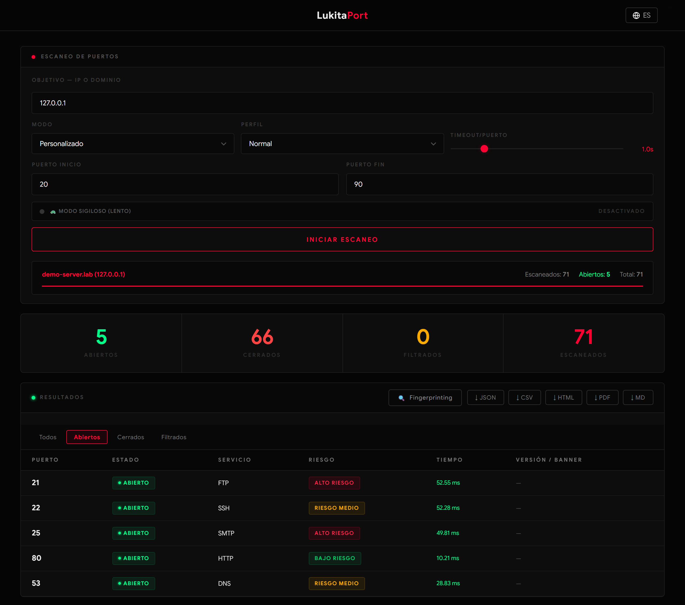
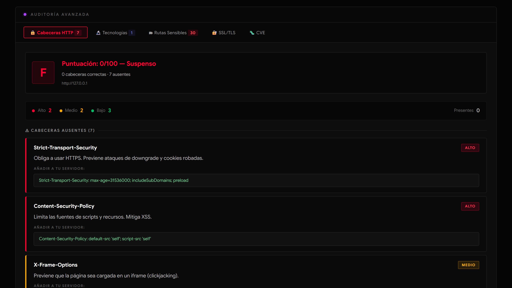

# LukitaPort

> Escáner de puertos TCP asíncrono con interfaz web en tiempo real, auditoría HTTP/TLS, búsqueda de CVEs y exportación de informes.
> *Async TCP port scanner with a real-time web UI, HTTP/TLS auditing, CVE lookup and report export — [English summary below](#english-summary).*

<p align="center">
  
  
  
  
</p>

| Escaneo en tiempo real | Auditoría HTTP automática |
|---|---|
|  |  |

<sub>Capturas generadas con `python scripts/screenshots.py`: servicios de prueba en 127.0.0.1, sin escanear ningún host externo.</sub>

---

## ⚠️ Uso responsable

LukitaPort es una herramienta **educativa** para analizar sistemas **propios o sobre los que tienes autorización expresa y por escrito**. Escanear, auditar o hacer capturas de sistemas ajenos sin permiso puede ser delito (en España, entre otros, el art. 197 bis del Código Penal) y suele violar las condiciones de uso de tu proveedor de red.

- **No es anónima.** El objetivo ve tu dirección IP en cada conexión. El «modo sigiloso (lento)» solo reduce el ritmo y aleatoriza el orden y los tiempos; no oculta nada.
- **Úsala en local.** Por defecto escucha solo en `127.0.0.1` y exige un token. No la publiques en Internet: cualquiera con acceso podría usar tu máquina para escanear a terceros.
- **Redes internas bloqueadas por defecto.** Los destinos internos (loopback, RFC 1918, link-local, CGNAT, metadatos de la nube…) están bloqueados salvo con `ALLOW_PRIVATE_IPS=true`. Actívalo solo en un laboratorio que controles.
- **Terceros**:
  - Las búsquedas de CVE consultan la API pública del NVD y la enumeración de subdominios consulta crt.sh. En ambos casos solo se envía el producto, la versión o el dominio, nunca la IP del objetivo.
  - La GeoIP está desactivada por defecto y, si se activa, es 100 % local.

---

## Qué hace

| Función | Detalle |
|---|---|
| **Escaneo TCP** | Connect scan asíncrono con resultados en streaming (SSE). Modos: rápido (30 puertos comunes), rango personalizado y completo (1–65535). Estados `open` / `closed` / `filtered` según `errno`. Captura de banners. |
| **Perfiles** | `normal` (100 sondas en paralelo), `stealth` / «Discreto» (10, con 0,5 s de pausa), `aggressive` (1000, limitado por el máximo de ficheros abiertos) y `slow` / «Sigiloso (lento)» (3 sondas, retardos aleatorios de 0,5–3 s, puertos en orden aleatorio). |
| **Fingerprinting** | `nmap -sV` sobre los puertos abiertos (requiere nmap instalado). |
| **Auditoría HTTP** | Cabeceras de seguridad (nota A–F), cabeceras que filtran información, detección de tecnologías (`tech_signatures.json`) y rutas sensibles (`/.git/HEAD`, `/.env`, paneles…). |
| **Análisis TLS** | Certificado (sujeto, emisor, SAN, caducidad), validez de la cadena, versiones TLS 1.0–1.3 aceptadas, cifrado y nota A+–F. |
| **CVEs** | Consulta al NVD por CPE (si nmap lo detecta) o por «producto versión». Respeta el límite de peticiones y admite `NVD_API_KEY`. |
| **Descubrimiento de red** | Ping sweep de redes IPv4 de /22 o más pequeñas. |
| **Subdominios** | Certificate Transparency (crt.sh) con resolución DNS. |
| **Capturas web** | Chromium sin interfaz (Playwright), opcional. |
| **Exportación** | JSON, CSV (sin inyección de fórmulas), HTML, Markdown y PDF. |
| **GeoIP** | Opcional y local con MaxMind GeoLite2. |

---

## Arquitectura

```
Navegador (ES modules, sin build)  ──HTTP/SSE──▶  FastAPI (main.py)
                                                   │  SecurityMiddleware: token, Host, CSP, rate limit
                                                   ├─ scanner.py        pool de workers asíncrono
                                                   ├─ resolver.py       DNS asíncrono + política SSRF + IP fijada
                                                   ├─ safe_http.py      HTTP saliente: IP fijada, redirecciones validadas
                                                   ├─ auditor.py        cabeceras, tecnologías, rutas
                                                   ├─ ssl_analyzer.py   certificado y versiones TLS
                                                   ├─ cve_lookup.py     cliente NVD (caché, back-off)
                                                   ├─ scan_service.py   nmap, ping, crt.sh, capturas, Markdown
                                                   └─ pdf_generator.py  informe PDF (ReportLab)
```

Detalles relevantes:

- **Concurrencia**:
  - El escaneo usa un número fijo de workers. Si el cliente se desconecta, todas las sondas se cancelan.
  - Las operaciones pesadas tienen un número máximo de ejecuciones simultáneas (`LUKITA_MAX_*`); cuando se alcanza, la API responde 429.
- **SSRF**:
  - Cada objetivo se resuelve una sola vez y se comprueban todas sus direcciones.
  - Todas las conexiones posteriores van a la IP fijada; el hostname solo viaja como `Host`/SNI.
  - Las redirecciones se validan salto a salto.
  - Chromium no accede a la red directamente: todas sus peticiones pasan por el mismo filtro.
- **Errores**: siempre con el formato `{"ok": false, "error": "<código>", "detail": "<mensaje>"}` y el código HTTP que corresponda (400, 401, 403, 404, 422, 429, 500, 502, 503).

---

## Instalación

Requisitos: **Python 3.11 a 3.14** en Linux, macOS o Windows. Opcionales: **nmap** (fingerprinting) y **Chromium vía Playwright** (capturas).

**Linux / macOS:**

```bash
git clone https://github.com/jaimefgdev/LukitaPort.git
cd LukitaPort
python -m venv .venv && source .venv/bin/activate
pip install -r requirements.txt          # versiones fijadas y verificadas por hash
playwright install --with-deps chromium  # opcional: capturas de pantalla
sudo apt install nmap                    # opcional: fingerprinting (brew install nmap en macOS)
```

**Windows (PowerShell):**

```powershell
git clone https://github.com/jaimefgdev/LukitaPort.git
cd LukitaPort
py -m venv .venv
.venv\Scripts\Activate.ps1
pip install -r requirements.txt          # uvloop se omite en Windows (marcador de plataforma)
playwright install chromium              # opcional: capturas de pantalla
winget install Insecure.Nmap             # opcional: fingerprinting
python run.py
```

Notas para Windows:
- `uvloop` no existe para Windows. El lock lo marca con `sys_platform != 'win32'`, así que pip lo omite y uvicorn usa el bucle de eventos estándar.
- Windows reintenta el SYN al recibir un RST, así que un puerto cerrado tardaría ~2 s en dar «rechazado». El escáner lo desactiva por socket (`SIO_TCP_INITIAL_RTO`, Windows 10 1703 o posterior) para que los puertos cerrados salgan como «cerrado» y no como «filtrado». En versiones anteriores espera hasta 2,5 s antes de clasificarlos.

`requirements.txt` y `requirements-dev.txt` son ficheros de bloqueo multiplataforma generados con `uv pip compile --universal` a partir de `pyproject.toml` (ver [Desarrollo](#desarrollo)).

## Ejecución

```bash
python run.py
```

- **Interfaz y token**:
  - Escucha en `http://127.0.0.1:8000`.
  - Si no hay `LUKITA_API_TOKEN`, genera un token en cada arranque e imprime una URL de acceso (`http://127.0.0.1:8000/#token=…`). El token va en el fragmento, que el navegador no envía al servidor.
  - Si defines `LUKITA_API_TOKEN`, la interfaz te lo pide.
- **Otras interfaces**: `run.py` **se niega a arrancar** en cualquier otra interfaz (`LUKITA_HOST=0.0.0.0`, una IP de la LAN…) si no has definido `LUKITA_API_TOKEN`.
- **Clientes de la API**: pueden autenticarse con `Authorization: Bearer <token>`. El esquema OpenAPI está en `/openapi.json` (Swagger UI está desactivado porque cargaría scripts de un CDN que la CSP prohíbe).

## Configuración

Todas las variables, con sus valores por defecto, están en [`.env.example`](.env.example). Un valor inválido detiene el arranque con un mensaje claro. Las más importantes:

| Variable | Defecto | Uso |
|---|---|---|
| `LUKITA_API_TOKEN` | *(generado)* | Token de la API, de 16 caracteres o más. Obligatorio fuera de loopback. |
| `LUKITA_HOST` / `LUKITA_PORT` | `127.0.0.1` / `8000` | Interfaz y puerto de `run.py`. |
| `LUKITA_ALLOWED_HOSTS` | `127.0.0.1,localhost,::1` | Cabeceras `Host` aceptadas (anti DNS rebinding). |
| `ALLOW_PRIVATE_IPS` | `false` | Permite objetivos internos. Solo para laboratorios propios. |
| `LUKITA_ENABLE_ADMIN` | `false` | Activa `/api/admin/*`. |
| `LUKITA_RATE_LIMIT` | `120` | Peticiones `/api/` por cliente y minuto. |
| `LUKITA_MAX_SCANS`, `…_NMAP`, `…_SCREENSHOTS`, `…_AUDITS`, `…_SSL` | `2, 1, 2, 2, 2` | Operaciones simultáneas. |
| `LUKITA_GEOIP_DB`, `LUKITA_GEOIP_ASN_DB` | — | Rutas a GeoLite2-City y GeoLite2-ASN. Activan la GeoIP local. |
| `NVD_API_KEY` | — | Clave del NVD: menos espera entre consultas. |
| `LOG_LEVEL` | `INFO` | Logs en JSON por stdout. |

## Docker

```bash
export LUKITA_API_TOKEN="$(python3 -c 'import secrets; print(secrets.token_urlsafe(32))')"
docker compose up --build
# Imagen «lite» sin Chromium (≈1 GB menos, sin capturas):
WITH_SCREENSHOTS=false docker compose up --build
```

- **Acceso**: abre `http://127.0.0.1:8000` e introduce el token.
- **Endurecimiento del compose**:
  - Publica el puerto solo en `127.0.0.1` y no arranca sin token.
  - Usuario sin privilegios, sin capabilities, sistema de ficheros de solo lectura (`/tmp` en tmpfs) y `no-new-privileges`.
  - Healthcheck contra `/api/health`.
- **GeoIP**: monta los ficheros `.mmdb` y define `LUKITA_GEOIP_DB` (ver comentarios en `docker-compose.yml`).

## API (resumen)

Todas las rutas `/api/` requieren el token, salvo `/api/auth`, `/api/auth/status` y `/api/health`.

| Método y ruta | Descripción |
|---|---|
| `GET /api/scan?target=&mode=&profile=&port_start=&port_end=&timeout=` | Escaneo por SSE: eventos `meta`, `port`, `done` o `cancelled`, o `{error, status}`. |
| `GET /api/resolve?target=` | Resolución con política SSRF (403 si es interno). |
| `GET /api/fingerprint?target=&ports=` | nmap `-sV` (máximo 100 puertos). |
| `GET /api/audit?target=&open_ports=` | Auditoría HTTP. |
| `GET /api/ssl?target=&open_ports=` | Análisis TLS de los puertos 443 y 8443. |
| `GET /api/cve?service=&version=&cpe=` / `POST /api/cve/batch` | CVEs del NVD (el lote admite hasta 20 puertos). |
| `GET /api/discover?cidr=&max_hosts=` | Ping sweep (IPv4, /22 o más pequeña). |
| `GET /api/subdomains?domain=` | Subdominios vía crt.sh. |
| `POST /api/screenshot/capture?target=&port=` / `GET /api/screenshot?target=` | Captura en segundo plano (503 si no hay Playwright). |
| `GET /api/geoip?target=` | GeoIP local (`enabled: false` si no está configurada). |
| `POST /api/export/md` / `POST /api/export/pdf` | Informes. |
| `POST /api/auth`, `GET /api/auth/status`, `POST /api/auth/logout` | Sesión del navegador: cookie HttpOnly con SameSite=Strict. |

## Desarrollo

```bash
pip install -r requirements-dev.txt
python -m pytest               # tests de Python
python -m pytest -m e2e        # tests de la interfaz en Chromium (requiere `playwright install chromium`)
node --test 'frontend/tests/*.test.mjs'   # tests del frontend (Node 22)
ruff check . && mypy .         # lint y tipos
pip-audit -r requirements.txt  # vulnerabilidades conocidas
```

**Regla de las pruebas:**
- Nunca se escanea ni se contacta un host externo. Los tests usan solo `127.0.0.1` con servidores que levanta el propio test, o sockets, DNS y subprocesos simulados.
- `tests/conftest.py` lo impone: un `connect` fuera de loopback, una resolución DNS de un nombre externo o un subproceso hacen fallar el test. La única excepción son los tests `e2e`, que pueden lanzar Chromium, y este solo carga páginas de un LukitaPort en `127.0.0.1`.

**Actualizar dependencias:** edita `pyproject.toml` y regenera los ficheros de bloqueo:

```bash
uv pip compile --universal --python-version 3.11 --generate-hashes --extra screenshots -o requirements.txt pyproject.toml
uv pip compile --universal --python-version 3.11 --generate-hashes --extra screenshots --extra dev -o requirements-dev.txt pyproject.toml
```

`--universal` conserva los marcadores de plataforma (por ejemplo, `uvloop ; sys_platform != 'win32'`), así que el mismo lock sirve en Linux, macOS y Windows. `tests/test_packaging.py` lo comprueba.

**CI** (GitHub Actions):
- ruff y mypy.
- pytest en Linux (3.11, 3.12 y 3.14) y en Windows (3.12 y 3.14).
- Tests de la interfaz en Chromium, pip-audit y tests del frontend.
- Imagen lite con prueba de arranque, e imagen completa con una captura real hecha dentro del contenedor.

## Estructura

```
├── main.py            API FastAPI (rutas, errores, lifespan)
├── run.py             arranque recomendado (valida interfaz y token)
├── settings.py        configuración (pydantic-settings)
├── security.py        token, sesión, Host, CSP, rate limit, tamaño de cuerpo
├── limits.py          ejecuciones simultáneas por operación
├── models.py          tipos validados y modelos de respuesta
├── scanner.py         escáner TCP (pool de workers)
├── resolver.py        DNS asíncrono + política SSRF
├── safe_http.py       cliente HTTP con IP fijada y redirecciones validadas
├── auditor.py         auditoría HTTP
├── ssl_analyzer.py    análisis TLS
├── cve_lookup.py      cliente NVD
├── scan_service.py    nmap, ping, crt.sh, capturas, informe Markdown
├── pdf_generator.py   informe PDF
├── geoip.py           GeoIP local (GeoLite2)
├── cache.py           caché TTL-LRU
├── config.py          riesgo por puerto
├── logging_config.py  logs estructurados en JSON
├── tech_signatures.json
├── frontend/          UI (index.html, *.js, styles.css) + tests de node
├── tests/             pytest (solo loopback o simulaciones)
├── pyproject.toml     metadatos, dependencias, ruff/mypy/pytest
├── requirements*.txt  ficheros de bloqueo (uv --universal, con hashes)
├── Dockerfile, docker-compose.yml, .dockerignore
└── .env.example
```

---

## English summary

Screenshots: [port scan](docs/scan.png) · [HTTP audit](docs/audit.png) (lab services on 127.0.0.1, generated with `python scripts/screenshots.py`).

LukitaPort is an **educational** async TCP port scanner with a real-time web UI (SSE), HTTP security-header auditing, technology detection, sensitive-path checks, TLS analysis, NVD CVE lookup, IPv4 ping sweep, crt.sh subdomain enumeration, optional Chromium screenshots and JSON/CSV/HTML/Markdown/PDF export.

**Responsible use:** only scan systems you own or are explicitly authorised in writing to test. The tool is **not anonymous**: the "stealth (slow)" mode only lowers the rate and randomises timing and port order.

**Quick start:** `pip install -r requirements.txt && python run.py`, then open the login URL printed on the console. Works on Linux, macOS and Windows with Python 3.11–3.14 (the lock files carry platform markers, e.g. `uvloop` is skipped on Windows).

**Security defaults:**
- Listens on 127.0.0.1 only.
- Every `/api/` route requires a token, which is mandatory off-loopback.
- Host header allow-list, CSP and rate limiting.
- Internal targets blocked unless `ALLOW_PRIVATE_IPS=true`.
- DNS answers pinned; redirects and browser requests are SSRF-checked.

**Configuration:** see [`.env.example`](.env.example).

**Docker:** `export LUKITA_API_TOKEN=…; docker compose up --build`.

**Tests:** `python -m pytest` and `node --test 'frontend/tests/*.test.mjs'`. They only ever touch 127.0.0.1 servers started by the tests, or mocks.

<p align="center"><sub>LukitaPort · MIT License · For educational use only · Solo para uso educativo</sub></p>
